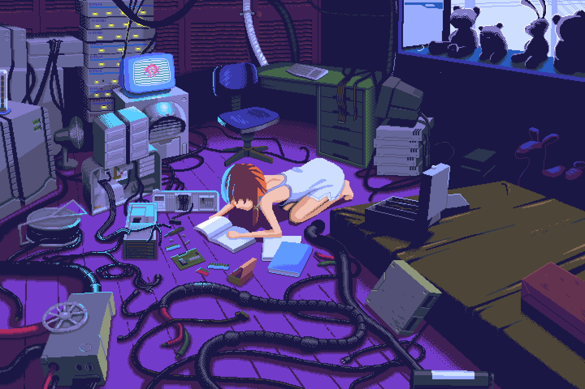
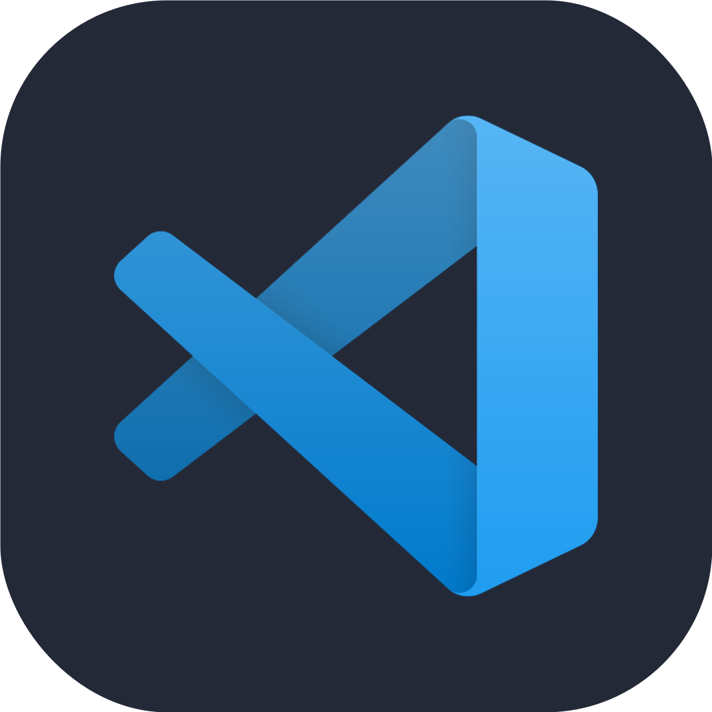
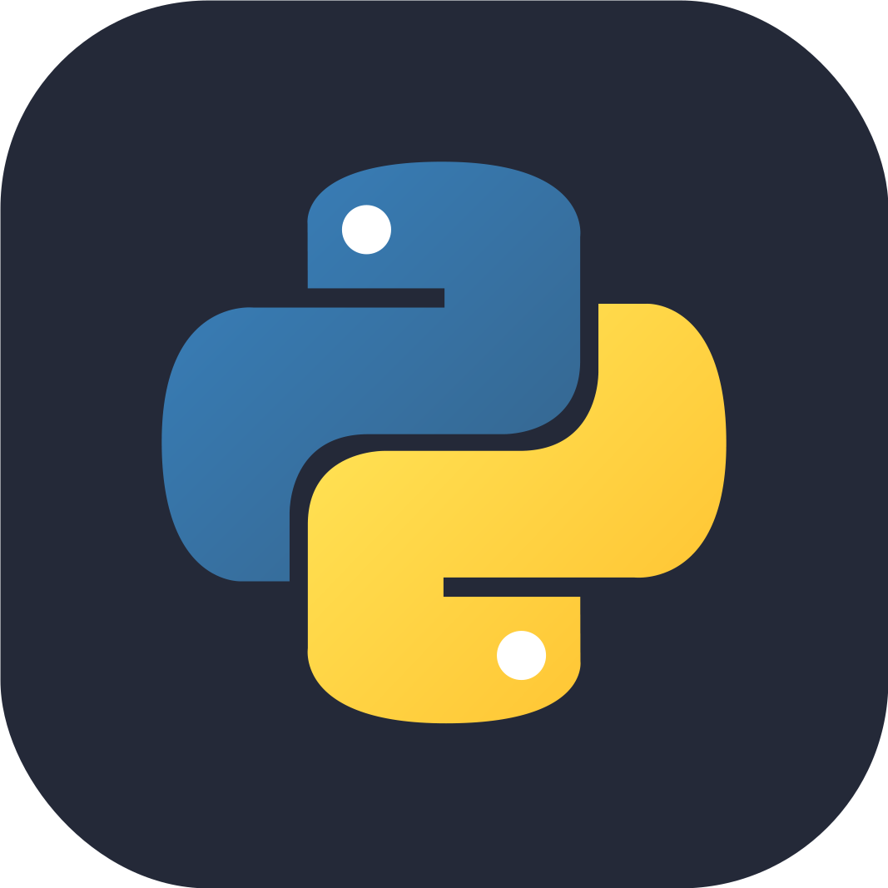
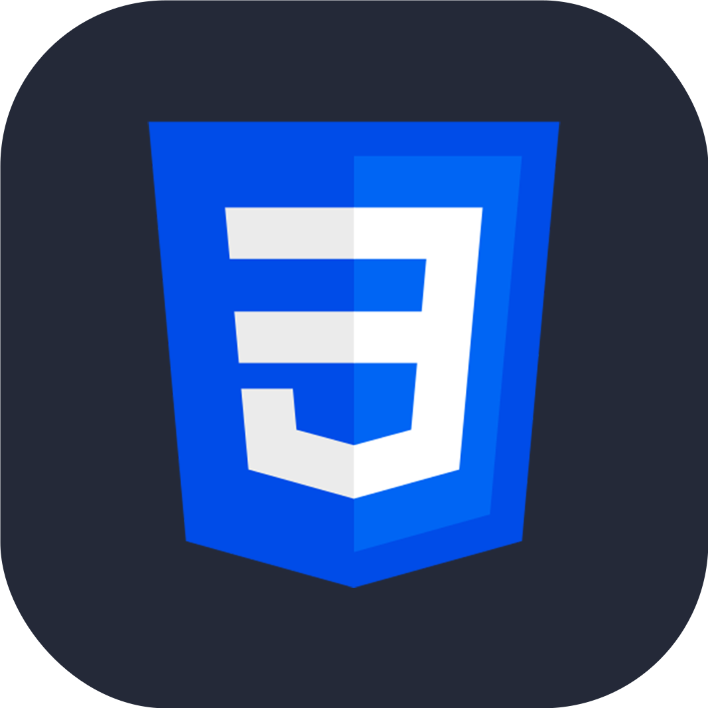
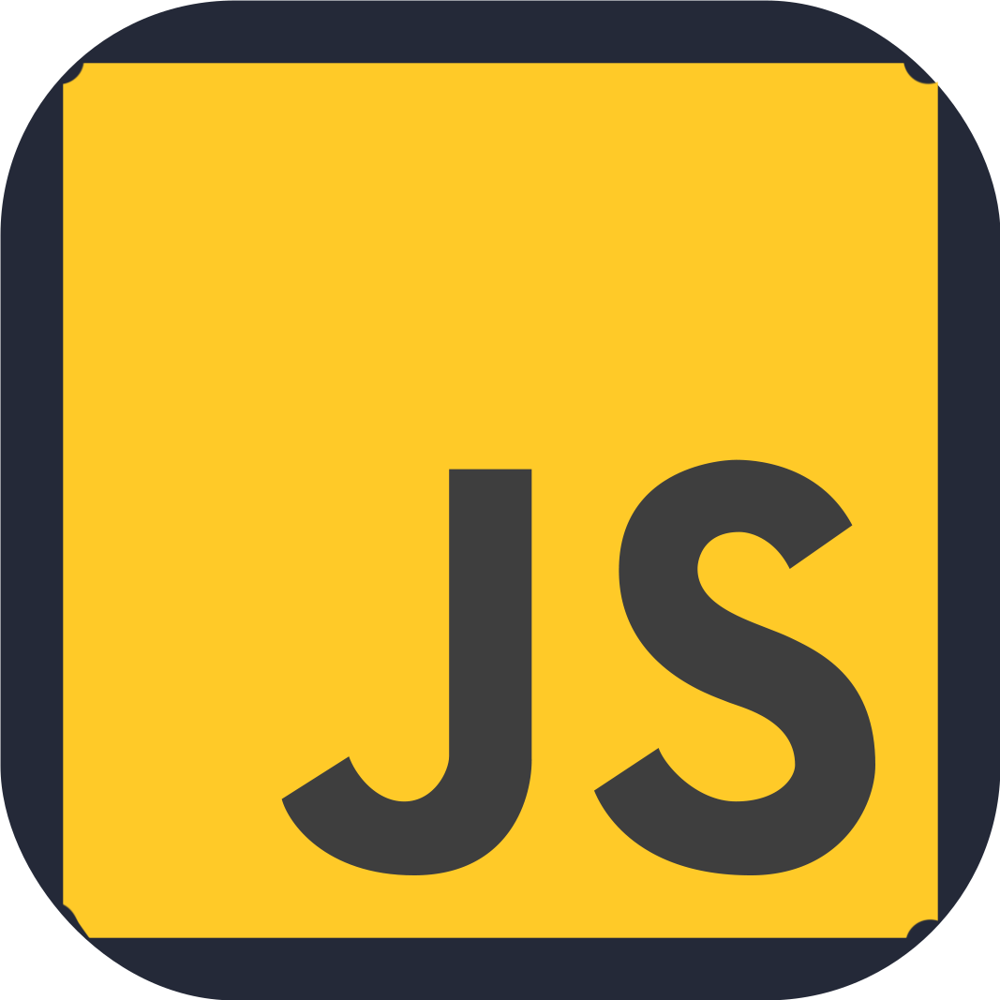
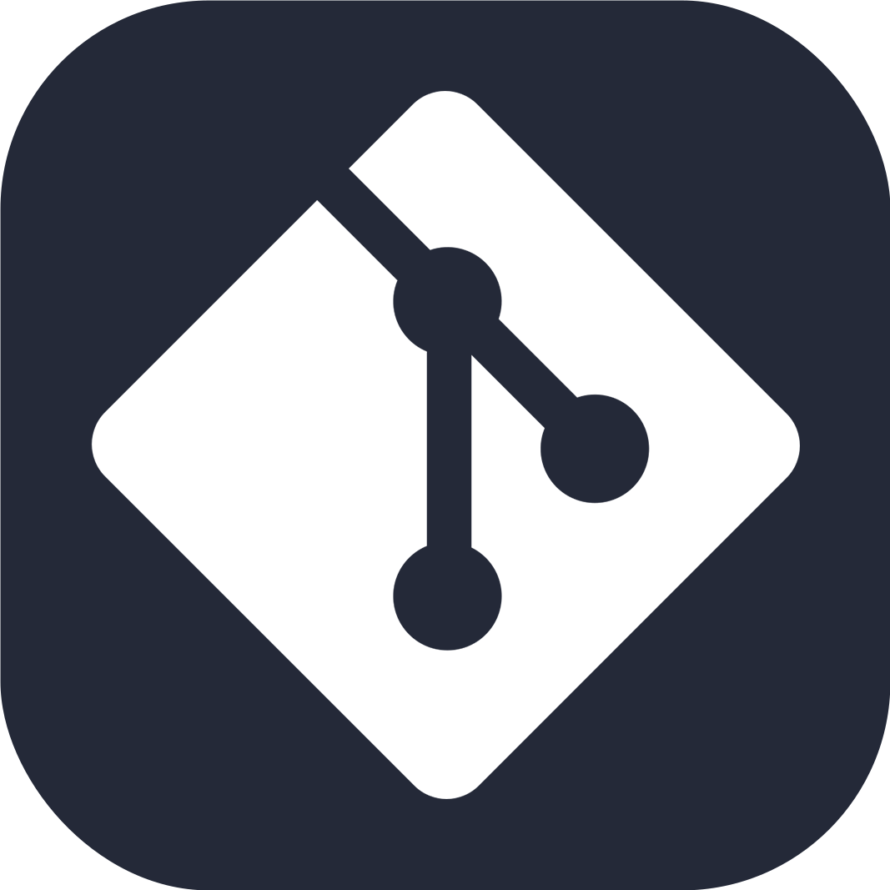

<h2>Sobre Eduarda Leigue! </h2>

Interessada por tecnologia e desenvolvimento web. Meu foco é criar interfaces intuitivas e funcionais, e estou sempre buscando aprimorar minhas habilidades em front-end e explorar novas áreas, como back-end.
 
- <em> Analista de Sistemas pelo Instituto Federal de Rondônia.</em>
- <em>Foco em dev front-end junior.</em>
- <em>Aprimorando habilidades de desenvolvimento web.</em>
- 👀 <em>Pequena curiosidade em back-end.</em>

### 

      <td></td>
      <td></td>
      <td></td>
      <td></td>
      <td></td>
      <td></td>

