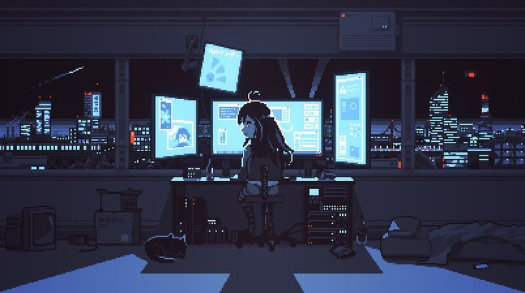
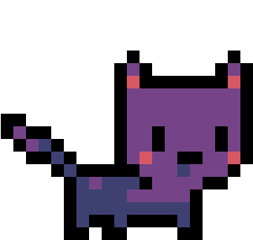

<h3>Hello World! 💻</h3>


### About Eduarda Leigue 
<p> An introverted character written by Dostoevsky, living in a <br> nightmare of thoughts, with one goal: to find the truth.</p>
<h6>Uma personagem introvertida escrita por Dostoiévski que vive <br> em um pesadelo de pensamentos com um único desejo, desvendar a verdade.</h6>


Here's my `Manifest.toml`:

```toml
[personal]
name = 'Eduarda Leigue'
city = 'Brazil'
email = 'ed.leigue@hotmail.com'

[learning]
currently-student = true
title = 'Systems Analysis and Development'
college = 'Federal Institute of Education Science 
and Technology of Rondônia.'

[interests]
'systems-analyst'
'web-developer'
```
